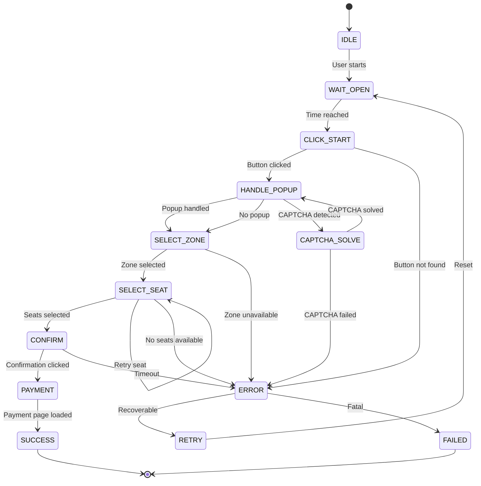
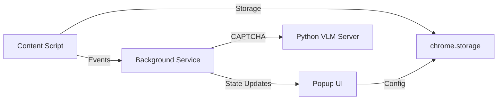

# Ticketing Automation - Chrome Extension Architecture

## Overview
Production-grade Chrome Extension for automated seat selection using Finite State Machine pattern with comprehensive error recovery.

## State Machine Design

### State Transition Diagram



### State Definitions

| State | Purpose | Entry Condition | Exit Condition | Error Handling |
|-------|---------|----------------|----------------|----------------|
| **IDLE** | Waiting for user activation | Extension loaded | User clicks start | N/A |
| **WAIT_OPEN** | Countdown to open time | Start clicked | Time === target | Cancellable |
| **CLICK_START** | Find and click reserve button | Time reached | Button clicked | Retry → ERROR |
| **HANDLE_POPUP** | Close/accept popup dialogs | After click | Popup dismissed | Timeout → Continue |
| **SELECT_ZONE** | Choose seat section | Popup handled | Zone clicked | No zones → ERROR |
| **SELECT_SEAT** | Select N seats | Zone loaded | Seats confirmed | Retry → ERROR |
| **CONFIRM** | Click confirmation button | Seats selected | Confirmed | Timeout → ERROR |
| **PAYMENT** | Navigate to payment | Confirmed | Payment page | - |
| **CAPTCHA_SOLVE** | Solve CAPTCHA if present | Detected | Solved | Fail → ERROR |
| **ERROR** | Handle recoverable errors | Any failure | Retry decision | - |
| **SUCCESS/FAILED** | Terminal states | Flow complete | - | - |

## Architecture Components

### 1. Core FSM Engine (`core/fsm.js`)

**Responsibilities:**
- State registration and transitions
- Event handling and dispatching
- State history tracking
- Error propagation

**Key Patterns:**
```javascript
class FSM {
  constructor() {
    this.states = new Map();
    this.currentState = 'IDLE';
    this.history = [];
    this.context = {};
  }
  
  async transition(nextState, data) {
    await this.states.get(this.currentState).onExit();
    this.history.push({from: this.currentState, to: nextState, timestamp: Date.now()});
    this.currentState = nextState;
    await this.states.get(nextState).onEnter(data);
  }
}
```

### 2. State Handlers (`states/`)

Each state is a class implementing:
- `onEnter(data)`: Initialization logic
- `execute()`: Main state logic
- `onExit()`: Cleanup
- `canTransition(nextState)`: Validation

**Pattern:**
```javascript
class WaitOpenState extends BaseState {
  async onEnter({targetTime}) {
    this.targetTime = targetTime;
    this.intervalId = setInterval(() => this.checkTime(), 100);
  }
  
  async execute() {
    if (Date.now() >= this.targetTime) {
      await this.fsm.transition('CLICK_START');
    }
  }
  
  onExit() {
    clearInterval(this.intervalId);
  }
}
```

### 3. DOM Utilities (`utils/dom.js`)

**Functions:**
- `waitForElement(selector, timeout)`: MutationObserver-based wait
- `safeClick(element)`: Click with validation
- `isElementReady(element)`: Visibility + enabled check
- `extractPageData()`: Parse JSON from window object

**Example:**
```javascript
async function waitForElement(selector, timeout = 5000) {
  return new Promise((resolve, reject) => {
    const element = document.querySelector(selector);
    if (element) return resolve(element);
    
    const observer = new MutationObserver(() => {
      const el = document.querySelector(selector);
      if (el) {
        observer.disconnect();
        resolve(el);
      }
    });
    
    observer.observe(document.body, {childList: true, subtree: true});
    setTimeout(() => {
      observer.disconnect();
      reject(new Error('Timeout waiting for ' + selector));
    }, timeout);
  });
}
```

### 4. Error Recovery (`core/recovery.js`)

**Strategy Matrix:**

| Error Type | Recovery Action | Max Retries | Fallback |
|------------|----------------|-------------|----------|
| Network timeout | Wait + Refresh | 3 | ERROR state |
| Element not found | Wait + Retry | 5 | ERROR state |
| Seat conflict | Select alternate | 10 | ERROR state |
| Popup loop | Force close + Continue | 3 | Skip popup |
| CAPTCHA | Call external solver | 1 | Manual |

**Implementation:**
```javascript
class RecoveryManager {
  async handle(error, context) {
    const strategy = this.strategies.get(error.type);
    
    if (context.retryCount < strategy.maxRetries) {
      await strategy.recover(context);
      context.retryCount++;
      return 'RETRY';
    }
    
    return strategy.fallback || 'FAILED';
  }
}
```

### 5. Configuration (`config/sites.js`)

Site-specific selectors and rules:
```javascript
const SITE_CONFIG = {
  interpark: {
    buttons: {
      reserve: '#btnReserve, .btn-booking',
      confirm: '.btn-confirm, #btnConfirm',
    },
    selectors: {
      seats: '.seat:not(.sold):not(.disabled)',
      popup: '.popup-overlay, .modal',
    },
    timing: {
      clickDelay: 50,
      loadTimeout: 3000,
    },
  }
};
```

## Edge Case Handling

### 1. Seat Conflicts
**Scenario:** Multiple users select same seat simultaneously.

**Solution:**
```javascript
async selectSeats(count) {
  const maxAttempts = count * 3; // Over-provision
  let selected = [];
  
  for (let i = 0; i < maxAttempts && selected.length < count; i++) {
    const seat = this.findNextSeat();
    if (await this.trySeat(seat)) {
      selected.push(seat);
    }
    await sleep(50); // Prevent spam
  }
  
  if (selected.length < count) {
    throw new Error('INSUFFICIENT_SEATS');
  }
}
```

### 2. Loading Delays
**Solution:** Progressive timeout strategy
```javascript
async waitWithBackoff(selector, maxTime = 10000) {
  const intervals = [100, 500, 1000, 2000];
  let elapsed = 0;
  
  for (const interval of intervals) {
    try {
      return await waitForElement(selector, interval);
    } catch {
      elapsed += interval;
      if (elapsed >= maxTime) throw new Error('TIMEOUT');
    }
  }
}
```

### 3. Popup Loops
**Solution:** Popup fingerprinting + count limiting
```javascript
class PopupTracker {
  constructor() {
    this.seen = new Set();
  }
  
  isNew(popup) {
    const fingerprint = this.hash(popup);
    if (this.seen.has(fingerprint)) return false;
    this.seen.add(fingerprint);
    return true;
  }
}
```

### 4. CAPTCHA
**Solution:** Hybrid approach
```javascript
async solveCaptcha(element) {
  // Try automatic solver first
  const autoResult = await this.tryAutoSolve(element);
  if (autoResult) return autoResult;
  
  // Fallback to VLM backend
  const image = await this.captureImage(element);
  return await fetch('http://localhost:8000/solve_captcha', {
    method: 'POST',
    body: JSON.stringify({image})
  });
}
```

## Debugging Strategy

### 1. State Visualization
Inject visual overlay showing current state:
```javascript
class DebugOverlay {
  update(state, context) {
    this.overlay.innerHTML = `
      <div class="fsm-debug">
        <div>State: ${state}</div>
        <div>Retries: ${context.retryCount}</div>
        <div>History: ${context.history.slice(-3).join(' → ')}</div>
      </div>
    `;
  }
}
```

### 2. Event Logging
Structured logging to background service:
```javascript
logger.log('STATE_TRANSITION', {
  from: 'SELECT_ZONE',
  to: 'SELECT_SEAT',
  data: {zone: 'A', seats: 2},
  timestamp: Date.now()
});
```

### 3. Snapshot Recording
Capture DOM state on errors:
```javascript
async captureSnapshot() {
  return {
    html: document.body.outerHTML,
    url: location.href,
    screenshot: await captureVisibleTab(),
    state: this.fsm.currentState,
    context: this.fsm.context
  };
}
```

### 4. Performance Profiling
Track state execution times:
```javascript
class PerformanceMonitor {
  async profile(fn, label) {
    const start = performance.now();
    const result = await fn();
    const duration = performance.now() - start;
    
    this.metrics.push({label, duration});
    return result;
  }
}
```

## Communication Architecture



### Message Protocol
```javascript
// Content → Background
{
  type: 'STATE_CHANGE',
  payload: {state: 'SELECT_SEAT', data: {...}}
}

// Background → Content
{
  type: 'COMMAND',
  payload: {action: 'START', config: {...}}
}
```

## Security Considerations

1. **Manifest Permissions**: Request only necessary permissions
2. **CSP Compliance**: No inline scripts, use nonces
3. **Storage Encryption**: Sensitive config in encrypted storage
4. **External Communication**: Whitelist localhost VLM server only

## Performance Optimizations

1. **Lazy State Loading**: Load state handlers on-demand
2. **Selector Caching**: Cache querySelector results
3. **Debounced Observers**: Limit MutationObserver frequency
4. **Worker Offloading**: Heavy computation in background worker

## Testing Strategy

1. **Unit Tests**: Each state handler independently
2. **Integration Tests**: Full flow simulation
3. **Mock Server**: Simulate timing/error scenarios
4. **Monkey Testing**: Random state transitions
